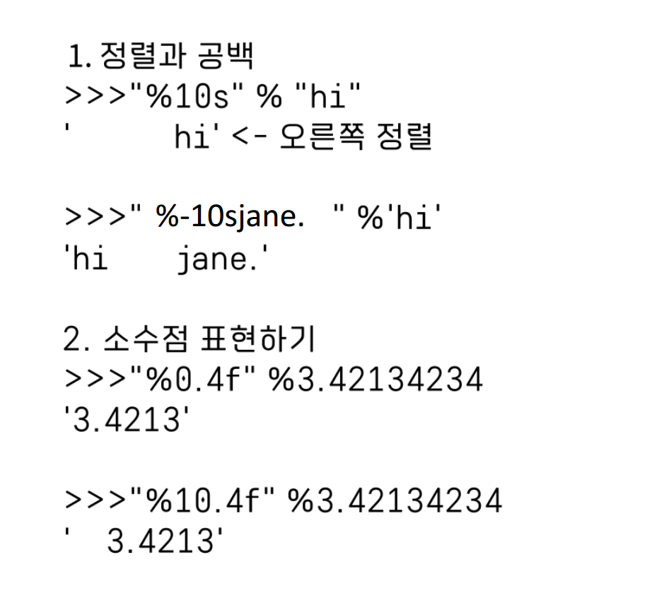

# Escape

```
\”  “를 그대로 출력
\’  ‘를 그대로 출력
\n  줄바꿈
\t  tab
\\  \를 그대로 출력
```

# 식별자

식별자 (Identifier) 변수 또는 함수 이름 생성규칙

-   키워드 사용불가
-   특수문자들 중에서는 ‘\_’만 허용
-   숫자로 시작불가
-   공백 포함 불가
-   대소문자 구분

```
• 사용가능 : alpha, alpha10, _alpha, AlpHa, ALPHA
• 사용불가능 : break, 273alpha, has space
```

# 연산자 우선 순위(높은 순위 순으로 나열)

```
• ( )
• \* / %
• + -
• == != < <= > >=
• not
• and
• or
```

# 문자열 포멧 코드

```
%s : 문자열
%c : 문자 1개
%d : 정수
%f : 부동소수
%o : 8진수
%x : 16진수
%% : %자체
```



# 숫자

2진수 표현
`0b1100111000`

8진수
`0o130`

16진수
`0x1A3F`

지수표현
`10e3`

자리수표현
`1.2345E2 # 10의 2승`

복소수

```
c = 3+4j #복소수
c.real() # 실수부
c.imag() # 허수부
c.conjugate() # 켤레복소수
```

# 리스트 연결 연산자

insert(), append(), extend()의 경우
원본에 직접적인 영향을 주어 파괴적 표현

단 연결 연산자는 원본에 영향을 주지 않음 (예 list_a + list_b)

# 리스트에 요소 제거하기(del, pop)

• 제거하는 방법 : 인덱스로 제거하기, 값으로 제거하기

• del 키워드 : del 리스트명[인덱스]

• pop() 함수 : 리스트명.pop(인덱스)

` 매개변수를 입력하지 않으면 마지막 요소 제거`

• remove(값) : 리스트명.remove(값)

` 값이 여러개일 경우 가장 앞에 있는 값만 제거`

• clear : 모두 제거하기

# 리스트 반전

[::-1] 를 하면 리스트를 반전시킬 수 있음

# 딕셔너리

쌍 추가하기

```
딕셔너리명[키] = 값
```

쌍 삭제하기

```
del 딕셔너리명[키]
```

딕셔너리에 키가 있는지 확인

```
키 in 딕셔너리명
```

요소 가져오기

```
딕셔너리명[키]
딕셔너리명.get(키)

딕셔너리명.keys() # 키만 가져오기
딕셔너리명.values() # 값만 가져오기
딕셔너리명.items() # 쌍으로 가져오기

```

# 세트

기본 문법과 특징
생성: set() 함수 또는 {} 기호를 사용하여 생성합니다.
순서 없음: 집합은 순서가 없어서 인덱싱, 슬라이싱이 불가능합니다. 요소에 접근하려면 리스트나 튜플로 변환해야 합니다.

```
s1 = set([1, 2, 3])
list_a = list(s1)  # 집합을 리스트로 변환
print(list_a[0])  # 리스트 인덱싱

t1 = tuple(s1)  # 집합을 튜플로 변환
print(t1[0])  # 튜플 인덱싱
```

집합 연산
교집합 (& 또는 intersection()):

```

s1 = set([1, 2, 3, 4, 5, 6])
s2 = set([4, 5, 6, 7, 8, 9])
print(s1 & s2) # {4, 5, 6}
print(s1.intersection(s2)) # {4, 5, 6}

```

합집합 (| 또는 union()):

```

print(s1 | s2) # {1, 2, 3, 4, 5, 6, 7, 8, 9}
print(s1.union(s2)) # {1, 2, 3, 4, 5, 6, 7, 8, 9}

```

차집합 (- 또는 difference()):

```

print(s1 - s2) # {1, 2, 3}
print(s1.difference(s2)) # {1, 2, 3}

```

대칭 차집합 (^ 또는 symmetric_difference()):

```

s3 = set([3, 6, 9, 12])
s4 = set([4, 6, 9, 12, 16])
print(s3 ^ s4) # {3, 4, 16}
print(s3.symmetric_difference(s4)) # {3, 4, 16}

```

# 튜플

튜플(Tuple)의 정의 및 사용
튜플은 파이썬의 기본 자료형 중 하나로, 리스트와 비슷한 특징을 가지고 있지만 주요 차이점이 몇 가지 있습니다. 튜플은 내용을 변경할 수 없는 읽기 전용 데이터를 저장할 때 주로 사용됩니다.

튜플 생성
튜플은 소괄호 ()를 사용하여 생성하며, 항목이 하나만 있는 경우에는 항목 뒤에 콤마 ,를 붙여야 합니다.

```
t1 = ()
t2 = (1,)  # 요소가 하나일 때 콤마 필수
t3 = (1, 2, 3)
t4 = 1, 2, 3  # 괄호 생략 가능
t5 = ('a', 'b', ('ab', 'cd'))
```

리스트와의 차이점
생성: 리스트는 [], 튜플은 () 또는 괄호 없이 콤마로만 구분.
수정 가능성: 리스트는 항목의 추가, 삭제, 수정이 가능하지만 튜플은 한 번 생성된 후 항목을 변경할 수 없습니다.
패킹과 언패킹
패킹: 하나의 변수에 여러 데이터를 할당하여 그룹화하는 것입니다.

```
color = 129, 247, 216  # 패킹
```

언패킹: 패킹된 변수에서 각 데이터를 분리하여 별도의 변수로 할당하는 것입니다.

```
red, green, blue = color  # 언패킹
student = ('홍길동', 20240401)
name, stud_num = student
print(name, stud_num)  # 홍길동 20240401
```

튜플의 수정과 삭제
튜플은 항목의 값을 수정하거나 삭제하는 것이 불가능하므로, 이러한 작업을 시도할 경우 오류가 발생합니다.

인덱싱, 슬라이싱, 더하기, 곱하기
튜플은 값을 변경할 수 없는 점을 제외하고는 리스트와 동일하게 인덱싱, 슬라이싱, 더하기, 곱하기 등의 연산을 사용할 수 있습니다.

```
t1 = (1, 2, 'a', 'b')
print(t1[0])  # 인덱싱
print(t1[1:3])  # 슬라이싱
```

# 반복

반복문: 기본 개념과 사용법
반복문은 프로그래밍에서 같은 코드를 여러 번 자동으로 실행하게 해주는 구조입니다. 파이썬에서는 주로 for 반복문과 while 반복문을 사용합니다.

1. For 반복문
   For 반복문은 정해진 범위 또는 시퀀스(리스트, 문자열 등)를 통해 반복을 수행합니다.

기본 사용법:

```
for 변수 in 반복할 수 있는 객체:
    실행할 코드
```

범위 지정 (range 함수 활용):

하나의 매개변수: range(n) → 0부터 n-1까지.
두 개의 매개변수: range(a, b) → a부터 b-1까지.
세 개의 매개변수: range(a, b, c) → a부터 b-1까지 c의 간격으로.

```
for i in range(10):  # 0부터 9까지 출력
    print(i)
```

역반복문:
reversed(range(n))를 사용하여 큰 숫자에서 작은 숫자로 반복.
range(시작, 끝, -간격)을 사용하여 역반복.

2. While 반복문
   조건이 참인 동안 반복을 수행합니다. 조건이 거짓이 될 때까지 코드 블록을 계속 실행합니다.

기본 사용법:

```
while 조건:
    실행할 코드
```

무한 반복과 종료 조건:
무한 반복: while True와 break 문을 사용하여 특정 조건에서 반복을 종료.
Ctrl + C를 통해 실행 중인 무한 반복을 중단할 수 있습니다.

3. 구구단 출력 예제 (중첩 반복문)
   중첩 반복문을 사용하여 2단부터 5단까지 출력:

```for dan in range(2, 6):
    for i in range(1, 10):
        print(f"{dan} * {i} = {dan * i}")
    print('------------')
```

4. 반복문과 자료형
   반복문은 다양한 자료형과 함께 사용될 수 있습니다:

문자열, 리스트, 튜플, 딕셔너리, 셋 등에서 요소를 순차적으로 접근할 때 사용됩니다.

1부터 20 사이의 정수 중 5의 배수 출력하기:

```
for i in range(1, 21):
    if i % 5 == 0:
        print(i)
```
